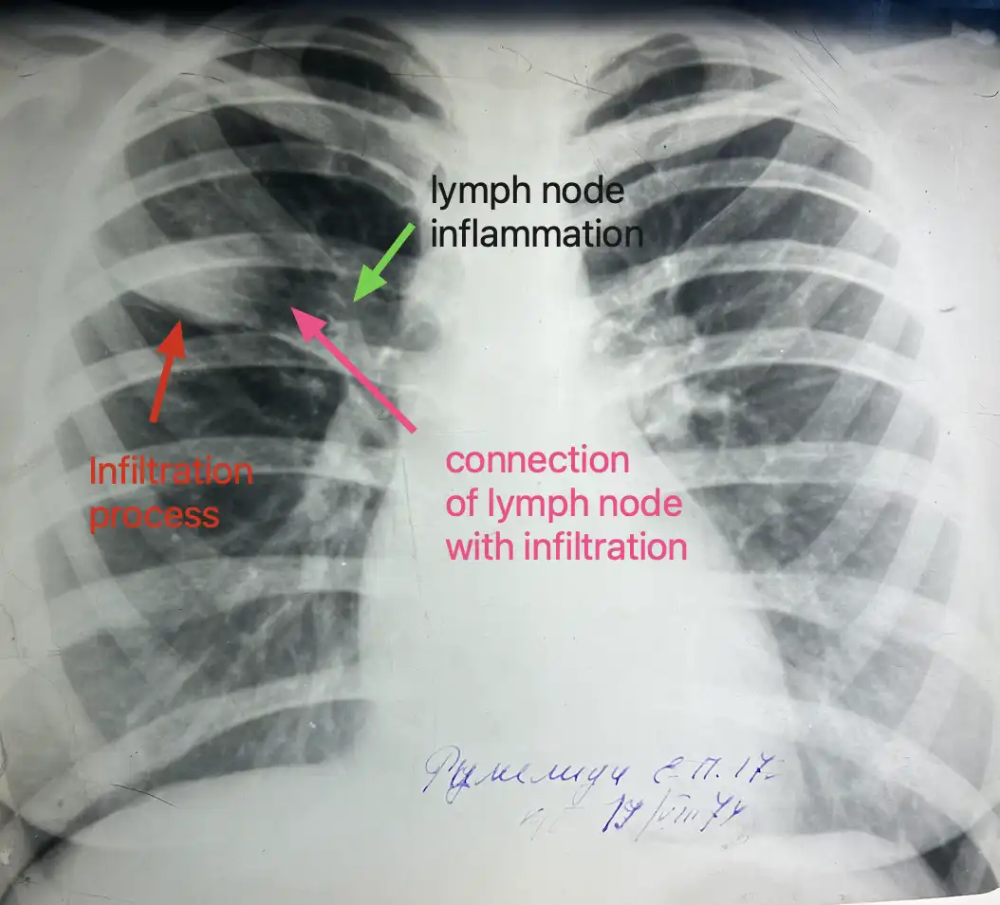
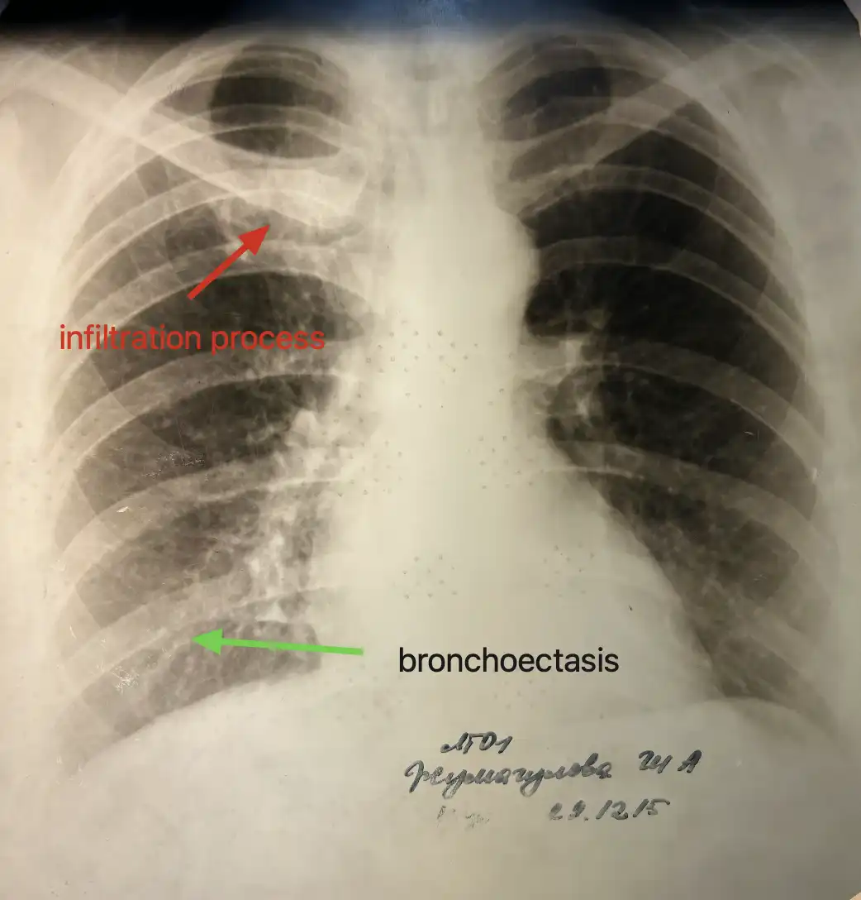
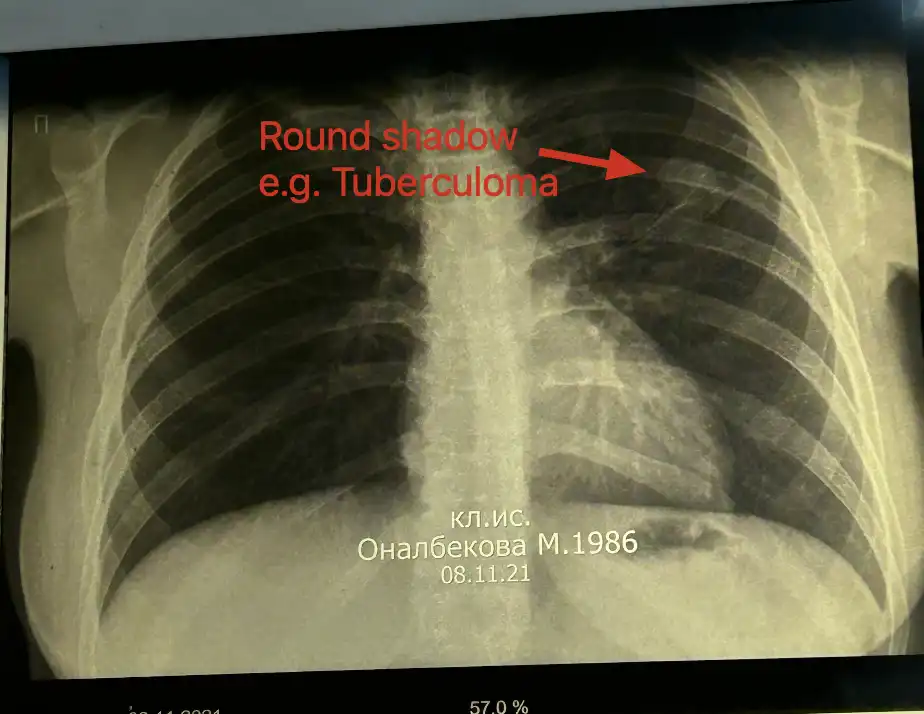
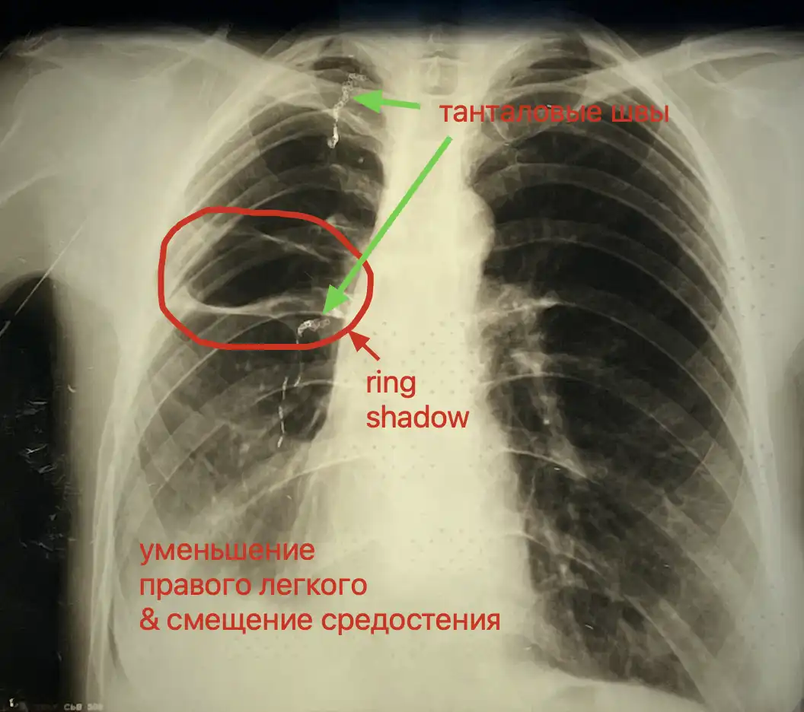
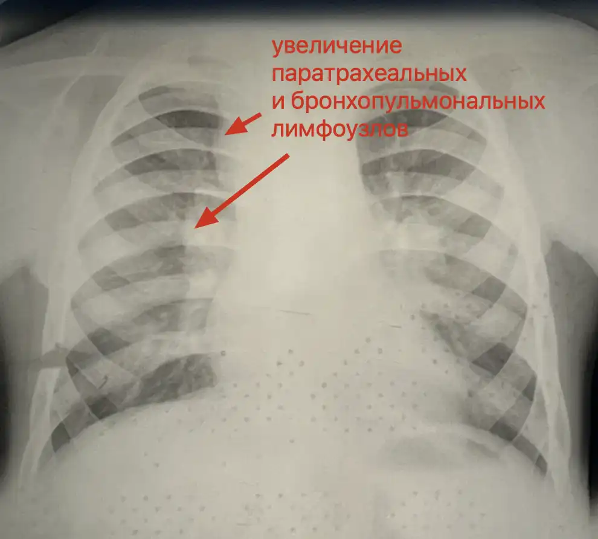
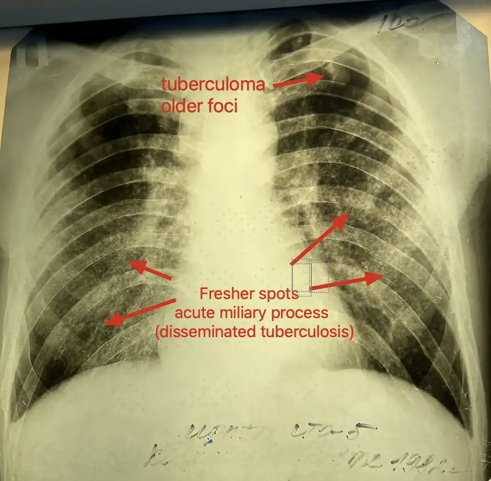

# Lecture notes
- **Laboratory diagnosis**
	- Bacterioscopic (TB is present or not)
		- Luminescent bacterioscopy is more accurate.
	- Bacteriologic smear (patient contagious or not)
	- Molecular-genetic (determination of the drug resistancy)
		- G-xpert (PCR method)

# X-ray

- Очаг это изменение до 1 см.

## Case 1: Primary tuberculosis (lymphangeitis)

- Teen young patient so it might be primary.

## Case 2: Infiltrative tuberculosis

- Broncho
- В стадии распада

## Case 3: Acute disseminated tuberculosis

- This is acute process because spots are separated and very small in size.
	- These little spots will form bigger structures which will be in chronic processes.;

## Case 4: Tuberculoma

- Differential diagnosis
	- Periphery tumor of lung (white round spot)
	- Echinoccosis
	- Filled cyst
	- Homotochondroma

## Case 5: Увеличение паратрахеальные и бронхопульмональные лимфотические 

- 5 year old kid
- Расширение тени средостения
- Паратрахеальные лимфотические узлы на протяжении корней легких
- Differential diagnosis
	- Sarcaidososis

## Case 6: Ring shadow

- Ring shadow (Кольцевидная тень)
- Танталовые швы (скрепки в легких) - цепочка в легких
	- Это является причинввой смещения средостения
- This is woman (because mammary glands visible)
- Emphysematous process on the lower parts of lung

# References
1. [Tuberculosis - X-ray diagnostics](http://www.learningradiology.com/notes/chestnotes/tbpage.htm)

