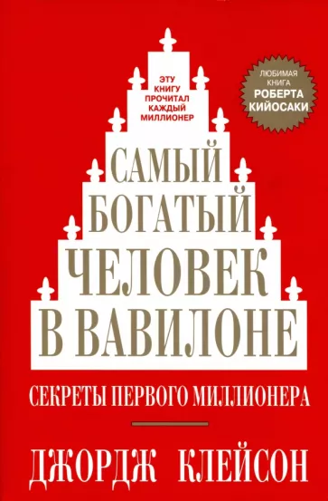

> Увлекательный способ донести мудрости о финансовой грамотности. Мне понравилось этот древний “вайб”, где на примере жителей Вавилона, объясняли важные вещи о финансовой грамотности. Атмосфера напоминает Алхимика - Паула Коэльо.

# Семь правил обогащения

### 1. Начните пополнять кошелек

Из каждых десяти монет, положенных в кошелек, тратить только девять.

### 2. Контролируй свои расходы

То что мы называем насущными потребностями, будет расти прямо пропорционально нашим доходам до тех пор, пока мы не воспротивимся такому порядку вещей.

Сколько бы вы денег не потратили, вы все равно не сможете удовлетворить все желания.

### 3. Приумножай богатство

Золото, что лежит в кошельке, греет и утешает душу, но это мертвый груз. 

Каждая монета должна работать и приносить постоянный доход, который неиссякаемым ручейком вливался бы в ваш кошелек.

### 4. Береги богатство от потерь

Охраняйте накопленное, инвестируя только в проекты, гарантирующие полную безопасность вклада, его возвратность в любой момент, а также солидные проценты. Консультируйтесь с компетентными людьми. Следуйте советам тех, кто преуспел в выгодных капиталовложениях. Их мудрость убережет ваше золото от рискованных инвестиций.

### 5. Превратите свое жилище в прибыльное предприятие

Стань собственником собственного дома.

### 6. Обеспечь доход на будущее

Заранее обеспечь себе достойную старость и позаботься о безбедном существовании своей семьи.

### 7. Совершенствуй умение зарабатывать

Совершенствовать свои способности и навыки, учиться и становиться мудрее, жить так, чтобы самому уважать себя.

## Заповеди

- Возвращать долги точно в срок, не влезать в долги, если их нечем отдавать.
- Заботиться о своей семье так, чтобы семья им гордилась.
- Составить завещание так, чтобы в случае его смерти собственность была поделена справедливо и достойно.
- Иметь сострадание к ущербным, несчастным, помогать им в разумных пределах. Быть внимательным к нуждам дорогих ему людей.

# Пять законов богатства

1. Золото тянется к тому, кто откладывает десятую часть своего заработка, обеспечивая будущее себе и своей семье.
2. Золото работает в полную силу на мудрого хозяина, который выгодно вкладывает его в дело
3. Золото нуждается в защите, а потому предпочитает осторожность и советы мудрых людей.
4. Золото не любит, когда его заставляют работать в той области, где человек не сведущ.
5. Золото ускользает от тех, кто вкладывает его в авантюрные или непродуманные проекты, воплощая романтические грезы о богатстве.

# Торговец верблюдами из Вавилона

**У тебя душа раба или свободного человека?**

Если ты и дальше будешь сидеть сложа руки и не предпринимать никаких попыток расплатиться, тогда можно твердо сказать, что у тебя душа раба. Никто не может считать себя уважаемым человеком, если он не платит по своим долгам.
- Но что могу сделать я, раб, да к тому же находящийся здесь, в Сирии?
- Оставайся рабом в Сирии, если ты такой трус.
- Я не трус,- горячо возразил я. 
- Тогда докажи это
- Как?
- Разве твой царь не бьется с врагом, всеми силами отражая его натиск? 
**Так вот твои долги - твои враги.**

<aside>
💡 Мои долги - мои враги, но мои кредиторы - мои друзья, потому что верили мне и доверили свои сбережения.

</aside>